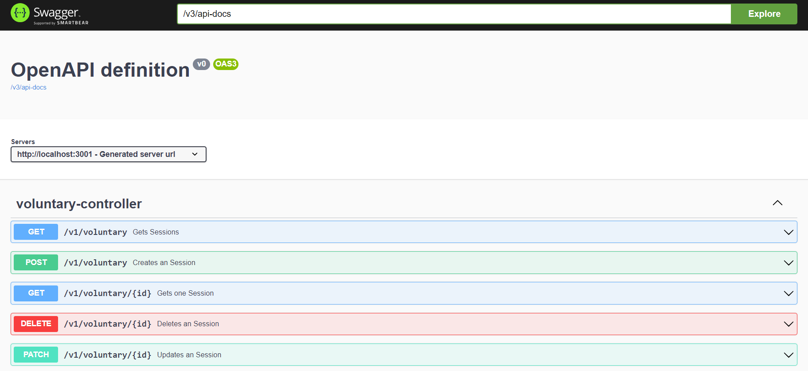

# pantanal_dev_B3_acao_social


## Tabela de Conteúdo

1. [Descrição](#descrição)
2. [Funcionalidades](#funcionalidades)
3. [Tecnologias](#tecnologias)
4. [Perfis](#perfis)
5. [Processo de Desenvolvimento](#processodesenvolvimento)
6. [Processos de Execução](#processoexecução)
7. [Processo de Deploy](#processodeploy)
8. [AWS-EC2](#awsec)
9. [Nginx](#nginx)
10. [Testes](#testes)
11. [Gerência e configuração com git e github](#gerencia)
12. [Arquitetura de Software](#arquitetura)
13. [SSO](#sso)
14. [Keyclock](#keyclock)
15. [Auditoria](#auditoria)
16. [Cargos e Permissões](#cargosepermissoes)
17. [Melhorias Futuras](#futuro)


## Descrição <a name="descrição"> </a>
- O projeto consiste em uma aplicação de gestão de ações sociais, defirentes Ong. Com a empresa
- Empresa (Company)
- ONG
- Ação Social (Social Action) é o projeto de uma ONG
- Company pode fazer diversos investimentos em uma Social Action
- Sessão (session) A Social Action pode ocorrer em uma ou muitas sessões
- voluntário (vonluntary) pode se candidatar ou ser convidado para ser da Staff
- Staff são os voluntarios membros da equipe organizadora de uma ação social
- o voluntário pode ir em qualquer session para trabalhar
- a presença do voluntário na sessão deve ser registrada via CPF ou QR code
- Categoria
  - nível da ação social
  - tipo da ação social
  - categoria da doação
  - categoria da sessão
  - categoria do investimento 
  - categoria do recurso

- Recursos
  - recursos da sessão
  - recursos da ação social
  - recursos da ong
  - recursos da empresa
  - recursos doados
  - recursos comprados com dinheiro de investimento da empresa
  - recursos comprados com dinheiro de doação de pessoa física

## Funcionalidades <a name="funcionalidades"> </a>
- Observação, "gestão" inclui normalmente criar, atualizar, buscar e deletar
- Autenticação e Autorização
- Gestão de Categorias
- Gestão de Empresas
  - Será possível cadastrar mais de uma empresa na mesmoa instancia do sistema, 
  - mas somente gerente de alto nível de acesso poderão visualizar dados de todas as empresas
- Gestão de Doações de Pessoa Física
  - É possivel registrar no sistema que determinada pessoa realizou doação de tal valor em determinado dia, com aprovação de um gerente de necessário
- Gestão de Investimento
  - É possivel que o gerente da empresa faça investimento em determinada Ong
- Pessoa pode manisvestar interesse em determinado tipo de ação social, futuramente irá para receber notificações
- Gestão de Ong
  - É possível cadastrar diversas Ongs e realizar sua gestão
- Gestão de Pcd
  - As pessoas podem informas que são PCD, e esta informação sempre será visivel para os gerente
  - Poderá ser implemetado um alerta para o gerente sobre a possível necessidade de gerar acessibilidade quando alguem com PCD se voluntaria para Ação Social.
- Gestão de Pessoas
- Gestão de Ação social com
  - Toda ação social deve pertencer a uma Ong
  - A ação social possui "visibilidade" que pode estar "privada", "pública somente para interno", "Pública até para os externos"
  - A ação social pode ter um Nivel
  - A ação social pode ter um Tipo
- Gestão de voluntarios da Ação Social
  - As pessoas cadastradas no sistema podem manifestar interesse em ser voluntário em uma ação social
  - Será possível que um gerente aprove ou não o voluntário para efetivar sua participação
  - Os voluntários aprovados poderão visualizar dados da ação social mesmo que esta esteja com "visibilidade" com valor "privada"
- Gestão de sessões da ação social
  - Sessão é a execução com data e hora de inicio e fim, e futuramente com local
  - Possui "visibilidade" que pode estar "privada", "pública somente para interno", "Pública até para os externos"
  - sessão deve ter quantos pontos de engajamento as pessoas presentes devem receber
- Gestão de presenças
  - Quando a pessoa esta presente na sessão ela deve ser registrada
  - e a pessoa recebe pontuação de engajamento, que cada sessão vindo da sessão

## Tecnologias <a name="tecnologias"> </a>
- spring boot
  - spring security
  - jpa
  - flyway
  - h2
  - spring web
  - lombok
  - Junit
  - Swagger
    - http://localhost:3001/swagger-ui/index.html#/
    - 
  - [LOG DE RASTREABILIDADE PARA AUDITORIA]
- postgres
  - Tomamos a decisão do banco de dados do postgres por alguns motivos
    - Padrão de mercado, amplamente usado
    - Grande quantidade de conteudo disponível
    - Conhecimento prévio dos membros da equipe
- docker
  - Decidimos utilizar docker por todas as vantagens de container
  - padronização de ambiente em que as diferentes aplicações estão, desde ambiente de desenvolvimento Linux e Windows
  - facilidade para executar as aplicações rapidamente por meio do docker-compose.yml
- Keyclock
  - É um dos maiores e mais populares SSO e IAM
  - É gratuito
  - Possui boa documentação e informações 
  - membros da equipe possuim conhecimento prévio

## Perfis <a name="perfis"> </a>
- Admininstrador
  - pessoa responsavel por instalar o sistema e cadastrar empresas e seu primeiro gerente
- Gerente da empresa
  - gerente da empresa é responsavel por gerir
- [futuro] Funcionário da empresa
- [futuro] Gerente pela ONG
- [futuro] Doador PF (não funcionário)

## Processo de desenvolvimento <a name="processodesenvolvimento"> </a>

- Kanban para controle de demandas a serem desenvolvidas
- Google docs para brainStorm, elaboração e documentação os requisitos
- Servidor do Discord para comunicação
  - compartilhamento de conteúdos 
  - compartilhamento de dúvidas
  - tira dúvidas técnicas
  - reuniões síncronas por chamada de voz
- Grupo do whatsApp para comunicação rápida e lembretes e avisos urgentes
- Foi utilizado o github para gerência e configuração de versionamento 

## Testes <a name="testes"> </a>
- Estamos usando como base principal os testes de integração, que apesar de mais custosos para implementar
- Agregam uma boa cobertura de testes, desde a funcionalidade em si estar funcionando e sua respectiva regra de negócio
- Até integração com outros serviços
  - não estamos mockando o banco de dados e nem o SSO
  - cada caso de teste usa realmente o keyclock para autenticar e autorizar
  - verificando se o usuário esta autenticado para executar a action do controller, caso seja necessário
  - verificando se o usuário tem a permissão para executar a action do controller, caso seja necessário
  - o banco de dados é realmente o postgres, para que garanta que restrições seja as mesmas do ambiente de produção
  - desta forma garantimos que os erros de consistência sejam validados
  - todo caso de teste está em uma transaction que faz rollback apos terminar
  - ao preparar os casos de teste, as vezes é preciso inserir dados fake para poder usados como base dos testes
    - o problema de que ao inserir dados pelo teste nao tem userLoggedId, e para resolver este problema foi criado uma classe LoginMock que é capaz de mock do spring security o userlogged
    - desta forma quando o teste inserir um registro no DB, será o user do token como createdBy UUID
- Possibilidade de melhoria nos teste, os testes foram inicialmente criados para contemplar somente o caso de sucesso com todos os campos sendo passados
  - criar testes de casos de falha
  - criar testes de casos de sucesso somente com campos obrigatorio

# Gerência e configuração com git e github <a name="gerencia"> </a>
- evitamos realizar commit diretamente na branch main
- merge para a main somente por meio de PR (Pull Request)
- tentamos usar commit semântico, padrão utilizado: https://blog.geekhunter.com.br/o-que-e-commit-e-como-usar-commits-semanticos/ 
- nomenclatura padrão para criação de branch:
- prefixo sempre é: @main
- pois está sendo criada a partir da branch main
- e quando uma branch e criado a partir de outra, segue o mesmo padrão
- desta forma:
- main
- @main/ticket56_titulo
- @main/@ticket56_titulo/ticket57_titulo
- @main/@ticket56_titulo/@ticket58_titulo
- @main/@ticket56_titulo/@ticket58_titulo/ticket59_titulo
- exemplo real:
```bash
$ git branch
  @main/38305473_docker
  @main/40263979_Interest_CRUD
  @main/41130419_criar_seeds
  @main/41673713_fix_getAll_session
  @main/41826671_fix_getAll_investimento
  @main/42261853_fix_tests
  @main/42468431_pontuacao_engajamento
* main
```

# Organização de diretórios
- os diretórios estão organizados em modulos 
- apesar de não ser uma arquitetura modular 
- a equipe optou por esta organização para facilitar na visualizações de arquivos durante o desenvolvimento

# Arquitetutra do software <a name="arquitetura"> </a>
- Arquitetura Monolítica, apesar de ter SSO/IAM
- A arquitetura do software é inspirada na arquitetura baseada em serviço, pois o fluxo das requisições são orientadas por "services" não "domain"
- a maior parte das regras de negócio estão contidas na camada de "service"
- podem existir algumas regras de negócio voltada para dados em outras cadamadas, principalmente validadores
- como na camada de DTO, Entity e Migration

## Keyclock: SSO (Single sign-on) Autenticação única / Identity and Access Management (IAM) gerenciamento de identidade e acesso <a name="sso"> </a>
- optamos por não implementar os serviços de autenticação e autorização
- optemos por usar uma ferramenta de SSO, no caso o Keyclock
- em nossa arquitetura, tercerizamos para o Keyclock gerencia tudo do usuário
- e o backend spring boot somente recebe o ID do user suas autorizações a partir do token da request
- que ja esta integrado com o spring security e validando a autenticação e autorização antes de executar as ações do controller
- os endpoint da api do keyclock são acionados pelo keyclock passando o token do user logged, para que o keyclock tenha log de auditoria de quem realizou as operações 

## Responsabilidade de cada camada de acordo com a arquitetura proposta
- controller
  - a camada de controller tem a responsabilidade de receber e retornar requisições HTTP rest
- service
  - a camada de service tem a responsabilidade de executar o fluxo do serviço necessário, incluindo regra de negócio
- dto (Data Transfer Object)
  - declara e valida entrada e saída de dados, Objeto de Transferência de Dados entre camadas, tanto internas quanto externas
- entity
  - classe que possui declarações de mapeamento de objeto relacional (ORM) do JPA 
- config
  - security
  - audit
  - web
  - postgres
- enum
  - para evitar valores mágicos e constantes soltas, vamos usar enum para estrurar as constantes, aumentando a qualidade de código do clean code
  - serão utilizadas principalmente para status e tipo, e outras informação que precisam aplicar regra de negócio em condicionais
- repository
  - É uma camada intermediária entre a aplicação e a base de dados
  - Ele fornece métodos para acessar e manipular os dados, como criar, ler, atualizar e excluir (CRUD)
  - O Repository abstrai a complexidade do acesso aos dados subjacentes e fornece uma interface consistente para a aplicação.
- db/migration
  - migrações do banco de dados
  - versionamento do banco de dados 
  - historico de mudanças na estrutura do banco de dados

## Configurações para o Keyclock <a name="keyclock"> </a>
- criar realm: realm-pantanal-dev
- criar client:
  - client-id: client-id-backend-1
  - Client authentication: on
    - Standard flow
    - Direct access grants
    - Service accounts roles
  - Root URL: http://localhost:3001/
  - Home URL: http://localhost:3001/
  - Valid redirect URIs: http://localhost:3001/*
  - Web origins: *
  - Admin URL: http://localhost:3001/
  - Credentials: client_secret: gerar secret e salvar no application.yml e application-dev.yml
- Cadastrar role neste padrão:
  - SOCIAL_ACTION_CREATE
  - SOCIAL_ACTION_GET_ALL
  - SOCIAL_ACTION_GET_ONE
  - SOCIAL_ACTION_UPDATE
  - SOCIAL_ACTION_DELETE
- Cadastrar usuário
  - username: funcionario1
  - password: 123
  - depois de salvar, na aba "credentials" adicionar uma senha
  - atribuir cargos para o usuário (role mapping)
- request para autenticação, e retorna access_token
  - grant_type: password
  - client_id: client-id-backend-1
  - username: funcionario1
  - password: 123
 
# Banco de dados
### exemplo de como acessar o DB por terminal de dentro do container docker
```bash
# entra dentro do container docker postgres
$ docker exec -it postgres_acao_social bash
# entre na databse
root@24de07c13cb3:/# PGPASSWORD=dev_password psql -U dev_user -d keycloack_postgres_db
```

### Como exportar dados para fazer backup do keyclock
```bash
# gera dump
$ sudo docker exec -u postgres postgres_acao_social pg_dump -U dev_user -d keycloack_postgres_db -f /tmp/backup_keycloak.sql
# copia o backup de dentro do docker para o a maquina host 
$ sudo docker cp postgres_acao_social:/tmp/backup_keycloak.sql /home/kaio/Documentos/ufms/pantanal_dev/projeto/acao_social/db/
```

### Orientações sobre Migration
  - sempre que criar uma nova tabela, lembre de criar junto sua tabela de auditoria, com o prefixo "z_aud_"
### Orientações sobre Seed
  - as seed são executadas automaticamente no ambiente de "development"
  - observação: em ambiente de "development" a estrutura do banco de dados está sendo gerado a partir das migration
  - https://github.com/DiUS/java-faker
  - A variável de ambiente executa o arquivo PostgresDatabaseInitialization (spring.profiles.active: dbinit)

## Auditoria <a name="auditoria"> </a>
- Revisão de mudanças dos registros
  - cada vez que um registro é criado ou alterado é criado uma revisão
  - spring-data-envers
- Dados de acesso rápido de detalhes de auditoria
  - todas as entidades do sistema possem estes dados para facilitar ao gerente um acesso rápido, sem precisar entrar em contato com o SRE para ter acesso aos detalhes da auditoria
  - createdDate, createdBy, lastModifiedDate, lastModifiedBy, deletedDate, deletedBy
- Auditoria de ações do usuário logado
  - https://medium.com/@helder.versatti/implementando-correlation-id-em-uma-aplica%C3%A7%C3%A3o-spring-c9c3a92c67e5
  - cada request feita, é criada um registro em formato json no STDOUT, com ID único para cada request, e quem o usuário ID que fez esta request
  
## Cargos e permissões (Roles and Permission) <a name="cargosepermissoes"> </a>
- existem algumas tabelas no bd utilizadas para determinar o relacionamento ManyToMany, como por exemplo, doação, voluntário e presente,
  - por exemplo "voluntário", deve ser uma tabela de junção/pivô para mapear que esta pessoa se voluntariou para participar de determinada ação social. Desta forma "voluntário" nao pode ser um cargo, pois quando uma pessoa se voluntaria é somente e exclusivamente para aquela ação social, e não automaticamente para todas.
- mas em Cargos e Permissoes do Keyclock diz respeito das capacidades que user logado tem de executar ou não determinada ação, como por exemplo o cargo funcionario_gerente_nivel_1 possui todas as permissões para criar, deletar, buscar e atualizar uma determinada ação social ou dados da empresa.
Neste cenário, quando o usuário recebe um cargo, ele tem o mesmo cargo em todas as partes do sistema, independente se ele for voluntario em uma ação social e tambem for gerente da empresa
- é de responsabilidade do Keyclock com redirecionamento de autenticação, recuperação de senha, atualizar cadastro do usuário, delegar cargos e permissões para usuário

# Auxílio I.A.
- uso de I.A. para aumentar a curva de aprendizagem
- chat gpt
- Bito (chat gpt integrado com intellij)
- Copilot

## Processo de execução em ambiente de desenvolvimento <a name="processoexecução"> </a>
- para executar em ambiente de desenvolvimento deve usar o docker/docker-compose.yml
- desta forma somente o keyclock e postgres estarão dentro do container
- assim podendo executar o spring boot diretamente no intellij para ter acesso ao debug
  $ cd docker/
  $ docker-compose down -v
  $ docker-compose up
  $ ./mvnw clean install
  $ SPRING_PROFILES_ACTIVE=dev ./mvnw spring-boot:run
- variável de ambiente para executar em ambiente de teste: "SPRING_PROFILES_ACTIVE=dev"

## Processo de execução em ambiente de teste
$ cd docker/
$ docker-compose up
- criar manualmente o database "postgres_testing" ao lado do database "postgres"
- executar os testes pelo intellij

## Processo de Deploy <a name="processodeploy"> </a>

## Processo de execução em ambiente de produção
$ docker-compose up
$ ./mvnw spring-boot:run

## AWS - EC2 <a name="awsec"> </a>
- acesso via SSH
  - cria chave SSH da VM EC2 e faz download
    - aws_ec2_pantanal_dev_ubuntu.pem
  - $ chmod 400 aws_ec2_pantanal_dev_ubuntu.pem
  - $ ssh -i "aws_ec2_pantanal_dev_ubuntu.pem" ubuntu@ec2-3-94-146-39.compute-1.amazonaws.com
    - digite: yes
  - já conectado no terminal da VM, faça clone do projeto
  - $ git clone https://SEU_TOKEN_DE_ACESSO_COM_PERMISSAO_PARA_ORGANIZACOES@github.com/Pantanal-dev-B3-acao-social/pantanal_dev_B3_acao_social_backend.git
    - login e senha do github
  - baixa e instala o docker, instalar o docker pelo curl ja vem configurado, pelo apt  e snap tem q configurar
  - $ curl -fsSL https://get.docker.com/ | sh  #
  - $ sudo docker -v
  - instalando docker-compose
  - $ sudo curl -L "https://github.com/docker/compose/releases/download/v2.3.3/docker-compose-$(uname -s)-$(uname -m)" -o /usr/local/bin/docker-compose
  - $ sudo chmod +x /usr/local/bin/docker-compose
  - $ sudo docker-compose -v
  - $ sudo docker-compose down -v
  - $ sudo docker-compose up --build

## Nginx <a name="nginx"> </a>
https://medium.com/@stevernewman/installation-of-nginx-on-aws-ubuntu-instance-e73e72cb8450
- sudo apt update -y
- sudo apt install nginx -y
- sudo systemctl status nginx
- sudo ufw allow 'Nginx Full'
- sudo ufw status
- cd /etc/nginx/sites-available/
- sudo nano meu_app_react
```txt
server {
  listen 80;
  server_name seu_nome_de_domínio_ou_endereço_ip;
  location / {
    proxy_pass http://127.0.0.1:3000;
    proxy_set_header Host $host;
    proxy_set_header X-Real-IP $remote_addr;
  }
}
```

## Melhorias futuras <a name="futuro"> </a>
- pontuação de engajamento pode ser usada para gameficação
  - pessoas com maior ponto podem receber insignia, como ouro, prata e bronze
  - pessoas com maior pontuação ganhar algo da empresa
- corrigir paginação no frontend
- implementar tratamento de exceções
- implementar testes unitários para as regras de negócio
- implementar filtro no frontend
- implementar funcionalidade de gestão de tarefas na sessão da ação social
- permitir funcionários da ONG acessar ao sistema 
  - para fazer a gestão de tarefas a serem executadas da ação social
  - para submeter documentos em contrato
- implementar testes unitários nas regras de negócio
- Business Intelligence e inteligência artificial
- análise a necessidade de migrar para arquitetura de microservices
- melhorar UX/UI
- implementar tratamento de exceções
- implementar CI/CD
- aumentar a porcentagem de cobertura de testes
- categoria de 
- implementar mídia social para
  - tipo de investimento
  - tipo de responsabilidade do contrato (obrigatório, opcional, obrigatório em ensino, obrigatório em emergencial)
  - tipo de sessão (presencial, remoto, síncrona, assíncrona, esforço, qualquer característica)
  - tipo de doação (tem bonus de pontuação de engajamento, em evento, internet)
- implementar contato para (acessível por: público externo, púplico interno, privado)
  - contato da ong
  - contato da pessoa
  - contato da empresa
  - contato da ação social
- implementar local
  - localização da Ong
  - localizacao da empresa
  - localizacao da pessoa
- implementar email
  - enviar email para todas as pessoas que estão previamente cadastradas como voluntário
  - enviar email para todas as pessoas que estavam presentes
  - enviar email para todas as pessoas que moram em determinada região 
  - enviar email para todas as pessoas que doaram
  - enviar email para todas as pessoas de determinada empresa
- implementar upload de arquivo
- implementar fomulário dinâmico para colher dados personalizados dos voluntários em cada ação social
- implementar gestão de recursos, com responsável, cautelado por, cautelado em, devolução em, estado de conservação
  - recursos materiais consumíveis
  - recursos materiais permanente
- página home com todas as ações sociais pública
- implementrar possibilidade dos funcionários logar para acessar ações sociais com visibilidade para somente público interno
- unificar person e user do keyclock
- pagina home com todas as ações sociais publica
- implementrar possibilidade dos funcionarios logar para acessar ações sociais com visibilidade para somente publico interno
- unificar person e user do keyclock alem do create, fazer tambem no update, delete e get
- implementar integração com Keyclock
  - atribuir cargo a user por tela
  - criar cargo por tela
  - recuperar senha
- cargos e permissões no frontend
- deixar o sistema com a capacidade de Multi-tenancy para isolar em uma unica instancia dados de diferentes empresas, para que os gerentes de uma não acesse dados das outras empresas

