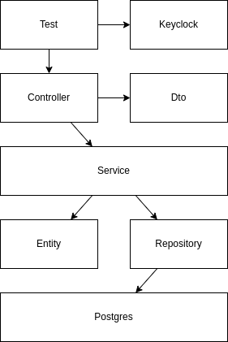
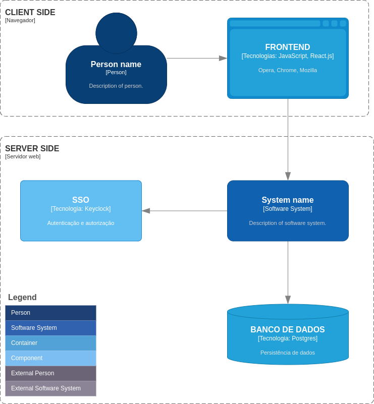
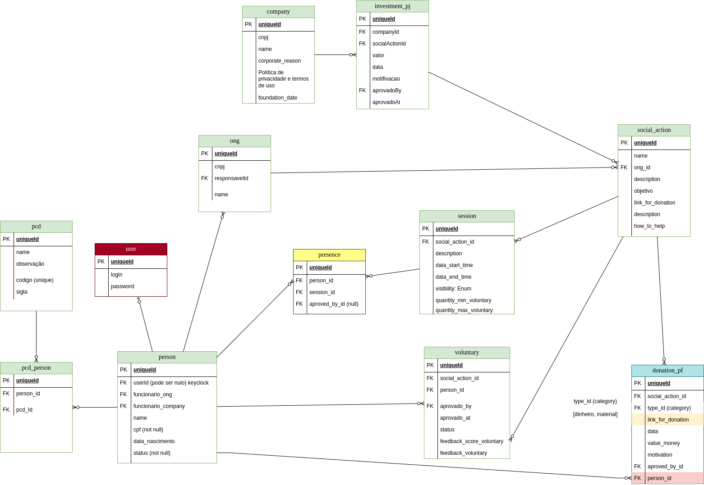

# pantanal_dev_B3_acao_social


## Tabela de Conteúdo

1. [Descrição](#descrição)
2. [Funcionalidades](#funcionalidades)
3. [Tecnologias](#tecnologias)
4. [Perfis](#perfis)
5. [Processo de Desenvolvimento](#processodesenvolvimento)
6. [Processos de Execução](#processoexecução)
7. [Processo de Deploy](#processodeploy)
8. [AWS-EC2](#awsec)
9. [Nginx](#nginx)
10. [Testes](#testes)
11. [Gerência e configuração com git e github](#gerencia)
12. [Arquitetura de Software](#arquitetura)
13. [SSO](#sso)
14. [Keyclock](#keyclock)
15. [Auditoria](#auditoria)
16. [Cargos e Permissões](#cargosepermissoes)
17. [Melhorias Futuras](#futuro)

## Descrição <a name="descrição"> </a>

  Nosso projeto tem como objetivo automatizar a gestão de ações sociais, estabelecendo uma conexão eficaz entre empresas, ONGs e voluntários. Utilizamos tecnologias modernas, incluindo Spring Boot 3 e Keycloak 21, além de implementar Docker para facilitar o desenvolvimento e a implantação do sistema. No frontend, criamos uma interface gráfica com React.js para demonstrar as funcionalidades essenciais do backend.

  A aplicação permite que funcionários da B3 se envolvam em ações sociais através de voluntariado ou doações. Eles podem se voluntariar para diferentes atividades sociais, com suas participações confirmadas por gestores responsáveis. Além do envolvimento dos funcionários, o sistema também oferece opções para investimentos diretos por parte das empresas, doações de fontes externas e fornece insights por meio de dashboards.

  Nossa abordagem não apenas promove a colaboração eficaz entre empresas, ONGs e voluntários, mas também garante a funcionalidade do sistema por meio de testes de integração rigorosos. Estamos comprometidos com a evolução contínua do projeto para atender às necessidades em constante mudança da comunidade. Nosso plano inclui a implementação contínua de funcionalidades adicionais para promover eficiência, transparência e automação nas operações entre as entidades envolvidas.


### Organização das Categorias

- **Nível da Ação Social**
- **Tipo da Ação Social**
- **Categoria da Doação**
- **Categoria da Sessão**
- **Categoria do Investimento**
- **Categoria do Recurso**


## Funcionalidades <a name="funcionalidades"></a>

### **Gestão(criar, atualizar, buscar e deletar)**
  

- **Autenticação e Autorização**
- **Gestão de Categorias**
- **Gestão de Empresas**
  - É possível cadastrar múltiplas empresas na mesma instância do sistema.
  - A visualização de dados de todas as empresas é restrita aos gerentes de alto nível.
  
- **Gestão de Doações de Pessoa Física**
  - Registre doações específicas de indivíduos em determinado valor e data, sujeito à aprovação de um gerente, quando necessário.

- **Gestão de Investimento**
  - Os gerentes da empresa podem investir em ONGs específicas.

- **Interesses em Ações Sociais**
  - As pessoas podem manifestar interesse em tipos específicos de ações sociais, recebendo notificações correspondentes no futuro.

- **Gestão de ONGs**
  - Cadastre várias ONGs e gerencie suas atividades.

- **Gestão de Pessoas com Deficiência (PCD)**
  - Indivíduos podem indicar que são PCD, e essa informação é visível para os gerentes.
  - Alertas podem ser implementados para os gerentes, indicando a necessidade de acessibilidade quando um voluntário com PCD se candidata a uma Ação Social.

- **Gestão de Pessoas**
  - Cadastre e gerencie detalhes sobre as pessoas envolvidas no sistema.

- **Gestão de Ações Sociais**
  - Toda ação social é associada a uma ONG específica.
  - Cada ação social possui uma "visibilidade", podendo ser "privada", "pública apenas para internos" ou "pública para externos".
  - A ação social pode ser categorizada por Nível e Tipo.

- **Gestão de Voluntários da Ação Social**
  - Indivíduos cadastrados no sistema podem expressar interesse em ser voluntários em uma ação social.
  - Gerentes podem aprovar ou recusar voluntários para participação efetiva.
  - Voluntários aprovados têm acesso aos dados da ação social, mesmo se ela estiver com "visibilidade" privada.

- **Gestão de Sessões da Ação Social**
  - Uma sessão é uma execução com data e hora de início e fim, podendo incluir futuramente informações sobre o local.
  - Cada sessão possui uma "visibilidade" que pode ser "privada", "pública apenas para internos" ou "pública para externos".
  - As sessões devem ter um número específico de pontos de engajamento atribuídos às pessoas presentes.

- **Gestão de Presenças**
  - Quando uma pessoa está presente em uma sessão, sua presença deve ser registrada.
  - As pessoas recebem pontos de engajamento baseados em sua participação, sendo esses pontos provenientes das sessões em que estiveram presentes.
 
- **Programa de milhas**
  - Para incentivar a participação ativa dos funcionários, cada vez que um funcionário participa de uma ação social, seja como voluntário, doador ou de qualquer outra forma, ele recebe pontos de engajamento com base em seu envolvimento e contribuição.

  - Os pontos podem ser acumuladoa ao longo do tempo. Os funcionários poderão então trocar esses pontos por recompensas arbitrárias definidas pela B3.
 


## Tecnologias Utilizadas <a name="tecnologias"></a>

### Spring Boot
- **Spring Security:** Utilizado para autenticação e autorização no sistema.
- **JPA (Java Persistence API) com QueryDSL:** Para interação com o banco de dados e consulta de dados de forma eficiente.
- **Flyway:** Utilizado para controle de versionamento do banco de dados.
- **H2 Database:** Um banco de dados em memória para desenvolvimento e testes.
- **Spring Web:** Para criar aplicativos web usando o Spring MVC.
- **Lombok:** Biblioteca Java que ajuda a reduzir o código boilerplate.
- **JUnit:** Framework de teste para Java.
- **Swagger:** Ferramenta para documentação de APIs. A documentação pode ser acessada em [http://localhost:3001/swagger-ui/index.html#/](http://localhost:3001/swagger-ui/index.html#/).
  
- **Log de Rastreabilidade para Auditoria:** Implementado para rastrear e auditar atividades no sistema.

### Banco de Dados PostgreSQL
- Optamos pelo PostgreSQL devido a:
  - **Padrão de Mercado:** Ampla adoção na indústria de TI.
  - **Abundância de Conteúdo Disponível:** Facilidade em encontrar recursos educacionais e suporte online.
  - **Conhecimento Prévio da Equipe:** Membros da equipe já possuem experiência com PostgreSQL.

### Docker
- Utilizamos Docker pelos seguintes motivos:
  - **Padronização de Ambiente:** Garante que as aplicações se comportem da mesma forma em diferentes ambientes, como desenvolvimento Linux e Windows.
  - **Facilidade com Docker Compose:** Permite a execução rápida das aplicações por meio do arquivo `docker-compose.yml`.

### Keycloak
- **SSO (Single Sign-On) e IAM (Identity and Access Management):** Keycloak é uma solução robusta para autenticação e controle de acesso.
- **Gratuito e com Boa Documentação:** Sendo uma ferramenta popular, possui uma comunidade ativa e documentação abrangente.
- **Conhecimento Prévio da Equipe:** Membros da equipe já possuem familiaridade com o Keycloak.


## Perfis <a name="perfis"></a>

- **Administrador:**
  - Pessoa responsável por instalar o sistema e cadastrar empresas e seu primeiro gerente.

- **Gerente da Empresa:**
  - Responsável por gerir as operações da empresa no sistema.

- **[Futuro] Funcionário da Empresa:**
  - [Planejado] Funcionários das empresas que podem interagir no sistema.

- **[Futuro] Gerente da ONG:**
  - [Planejado] Gerentes das Organizações Não Governamentais (ONGs) para gerenciar suas atividades.

- **[Futuro] Doador Pessoa Física (PF):**
  - [Planejado] Indivíduos que podem fazer doações no sistema, mesmo que não sejam funcionários das empresas.

## Processo de Desenvolvimento <a name="processodesenvolvimento"></a>

- **Kanban:** Utilizado para controle de demandas a serem desenvolvidas.

- **Google Docs:** Usado para brainstorming, elaboração e documentação dos requisitos do sistema.

- **Servidor do Discord:** Plataforma de comunicação que inclui:
  - Compartilhamento de conteúdos.
  - Discussões e esclarecimento de dúvidas técnicas.
  - Reuniões síncronas por chamadas de voz.
  - Daily meetings para acompanhamento do progresso.

- **Grupo do WhatsApp:** Usado para comunicação rápida, lembretes e avisos urgentes.

- **GitHub:** Utilizado para gerência e configuração de versionamento do código fonte.

## Testes <a name="testes"></a>

- Estamos utilizando principalmente testes de integração, apesar de serem mais custosos para implementar.

- Esses testes oferecem uma cobertura abrangente, incluindo:
  - Funcionalidade real do sistema e suas regras de negócio.
  - Integração com outros serviços, sem mockar o banco de dados e nem o SSO (Single Sign-On).
  - Autenticação e autorização real usando Keycloak.
  - Verificação das permissões do usuário para executar ações do controlador.
  - Utilização do banco de dados PostgreSQL para validar as restrições do ambiente de produção.
  - Garantia de consistência nos dados ao utilizar transactions e rollbacks nos casos de teste.
  - Preparação dos dados de teste, incluindo inserção de dados fake usando uma classe `LoginMock` para simular o usuário logado.

- Possibilidades de Melhoria nos Testes:
  - Adicionar testes para casos de falha.
  - Criar testes para casos de sucesso com campos obrigatórios apenas.
  
  


## Gerência e Configuração com Git e GitHub <a name="gerencia"></a>

- **Evitamos** realizar **commits** diretamente na branch **main**.
- Merges para a **main** são feitos somente por meio de **PRs (Pull Requests)**.
- Utilizamos o conceito de **commit semântico**. O padrão utilizado segue [este guia](https://blog.geekhunter.com.br/o-que-e-commit-e-como-usar-commits-semanticos/).
- **Nomenclatura padrão para criação de branches:**
  - Prefixo sempre é: **@main**, pois é criada a partir da branch **main**.
  - Quando uma branch é criada a partir de outra, segue o mesmo padrão.
  - **Exemplo:**
    ```bash
    $ git branch
      @main/38305473_docker
      @main/40263979_Interest_CRUD
      @main/41130419_criar_seeds
      @main/41673713_fix_getAll_session
      @main/41826671_fix_getAll_investimento
      @main/42261853_fix_tests
      @main/42468431_pontuacao_engajamento
    * main
    ```

## Organização de Diretórios

- Os diretórios estão organizados em **módulos**.
- Apesar de não ser uma arquitetura modular, a equipe optou por essa organização para facilitar a visualização de arquivos durante o desenvolvimento.

## Arquitetura do Software <a name="arquitetura"></a>

- **Arquitetura de camadas** com integração via **HTTP com SSO/IAM**.
- Inspirada na arquitetura baseada em **serviço**, onde o fluxo das requisições é orientado por "services" e não "domain".
- A maior parte das regras de negócio está contida na camada de **"service"**.
- Algumas regras de negócio voltadas para dados podem estar em outras camadas, principalmente em validadores, como na camada de **DTO**, **Entity** e **Migration**.

  

  

## Keycloak: SSO (Single Sign-On) Autenticação Única / Identity and Access Management (IAM) Gerenciamento de Identidade e Acesso <a name="sso"></a>

- Optamos por não implementar os serviços de autenticação e autorização no próprio sistema.
- Utilizamos a ferramenta de SSO, o **Keycloak**, para gerenciar a autenticação e autorização.
- Na nossa arquitetura, terceirizamos para o **Keycloak** a responsabilidade de gerenciar todas as informações do usuário.
- O backend Spring Boot apenas recebe o ID do usuário e suas autorizações a partir do token da requisição.
- Já está integrado com o Spring Security e valida a autenticação e autorização antes de executar as ações dos controladores.
- Os endpoints da API do **Keycloak** são acionados pelo sistema, passando o token do usuário logado, para que o **Keycloak** mantenha um registro de auditoria de quem realizou as operações.

## Responsabilidade de Cada Camada de Acordo com a Arquitetura Proposta

- **Controller:**
  - Responsável por receber e retornar requisições HTTP REST.

- **Service:**
  - Responsável por executar o fluxo do serviço necessário, incluindo regras de negócio.

- **DTO (Data Transfer Object):**
  - Declara e valida entrada e saída de dados.
  - Objeto de Transferência de Dados entre camadas, tanto internas quanto externas.

- **Entity:**
  - Classe que possui declarações de mapeamento de objeto relacional (ORM) do JPA.

- **Config:**
  - **Security**
  - **Audit**
  - **Web**
  - **PostgreSQL**

- **Enum:**
  - Utilizados para evitar valores mágicos e constantes soltas.
  - Estruturam as constantes, melhorando a qualidade do código conforme os princípios do clean code.
  - Principalmente usados para status, tipos e outras informações que requerem regras de negócio em condicionais.

- **Repository:**
  - Camada intermediária entre a aplicação e a base de dados.
  - Fornece métodos para acessar e manipular os dados (CRUD).
  - Abstrai a complexidade do acesso aos dados e oferece uma interface consistente para a aplicação.

- **DB/Migration:**
  - Migrações do banco de dados.
  - Histórico de mudanças na estrutura do banco de dados.

## Configurações para o Keycloak <a name="keycloak"></a>

- Criar o realm: **realm-pantanal-dev**.

- Criar um cliente:
  - **Client ID:** client-id-backend-1
  - **Client Authentication:** Ativado
    - **Standard Flow**
    - **Direct Access Grants**
    - **Service Accounts Roles**
  - **Root URL:** [http://localhost:3001/](http://localhost:3001/)
  - **Home URL:** [http://localhost:3001/](http://localhost:3001/)
  - **Valid Redirect URIs:** [http://localhost:3001/*](http://localhost:3001/*)
  - **Web Origins:** *
  - **Admin URL:** [http://localhost:3001/](http://localhost:3001/)
  - **Credenciais:** **Client Secret:** Gerar um segredo e salvar no arquivo `application.yml` e `application-dev.yml`.

- Cadastrar as seguintes roles:
  - SOCIAL_ACTION_CREATE
  - SOCIAL_ACTION_GET_ALL
  - SOCIAL_ACTION_GET_ONE
  - SOCIAL_ACTION_UPDATE
  - SOCIAL_ACTION_DELETE

- Cadastrar um usuário:
  - **Username:** funcionario1
  - **Password:** 123
  - Após salvar, na aba "Credentials," adicione uma senha.
  - Atribua funções ao usuário (role mapping).

- Realizar uma requisição para autenticação, que retornará um **access_token**:
  - **grant_type:** password
  - **client_id:** client-id-backend-1
  - **username:** funcionario1
  - **password:** 123

# Banco de Dados

### Exemplo de como acessar o banco de dados pelo terminal de dentro do container Docker:

```bash
# Entre dentro do container Docker PostgreSQL
$ docker exec -it postgres_acao_social bash

# Acesse o banco de dados
root@24de07c13cb3:/# PGPASSWORD=dev_password psql -U dev_user -d keycloack_postgres_db


### Como exportar dados para fazer backup do keyclock
```bash
# gera dump
$ sudo docker exec -u postgres postgres_acao_social pg_dump -U dev_user -d keycloack_postgres_db -f /tmp/backup_keycloak.sql
# copia o backup de dentro do docker para o a maquina host 
$ sudo docker cp postgres_acao_social:/tmp/backup_keycloak.sql /home/kaio/Documentos/ufms/pantanal_dev/projeto/acao_social/db/
```

### Orientações sobre Migration
  - sempre que criar uma nova tabela, lembre de criar junto sua tabela de auditoria, com o prefixo "z_aud_"
### Orientações sobre Seed
  - as seed são executadas automaticamente no ambiente de "development"
  - observação: em ambiente de "development" a estrutura do banco de dados está sendo gerado a partir das migration
  - https://github.com/DiUS/java-faker
  - A variável de ambiente executa o arquivo PostgresDatabaseInitialization (spring.profiles.active: dbinit)




## Auditoria <a name="auditoria"> </a>
- Revisão de mudanças dos registros
  - cada vez que um registro é criado ou alterado é criado uma revisão
  - spring-data-envers
- Dados de acesso rápido de detalhes de auditoria
  - todas as entidades do sistema possem estes dados para facilitar ao gerente um acesso rápido, sem precisar entrar em contato com o SRE para ter acesso aos detalhes da auditoria
  - createdDate, createdBy, lastModifiedDate, lastModifiedBy, deletedDate, deletedBy
- Auditoria de ações do usuário logado
  - https://medium.com/@helder.versatti/implementando-correlation-id-em-uma-aplica%C3%A7%C3%A3o-spring-c9c3a92c67e5
  - cada request feita, é criada um registro em formato json no STDOUT, com ID único para cada request, e quem o usuário ID que fez esta request
  
## Cargos e permissões (Roles and Permission) <a name="cargosepermissoes"> </a>
- existem algumas tabelas no bd utilizadas para determinar o relacionamento ManyToMany, como por exemplo, doação, voluntário e presente,
  - por exemplo "voluntário", deve ser uma tabela de junção/pivô para mapear que esta pessoa se voluntariou para participar de determinada ação social. Desta forma "voluntário" nao pode ser um cargo, pois quando uma pessoa se voluntaria é somente e exclusivamente para aquela ação social, e não automaticamente para todas.
- mas em Cargos e Permissoes do Keyclock diz respeito das capacidades que user logado tem de executar ou não determinada ação, como por exemplo o cargo funcionario_gerente_nivel_1 possui todas as permissões para criar, deletar, buscar e atualizar uma determinada ação social ou dados da empresa.
Neste cenário, quando o usuário recebe um cargo, ele tem o mesmo cargo em todas as partes do sistema, independente se ele for voluntario em uma ação social e tambem for gerente da empresa
- é de responsabilidade do Keyclock com redirecionamento de autenticação, recuperação de senha, atualizar cadastro do usuário, delegar cargos e permissões para usuário

# Auxílio I.A.
- uso de I.A. para aumentar a curva de aprendizagem
- chat gpt
- Bito (chat gpt integrado com intellij)
- Copilot

## Processo de execução em ambiente de desenvolvimento <a name="processoexecução"> </a>
- para executar em ambiente de desenvolvimento deve usar o docker/docker-compose.yml
- desta forma somente o keyclock e postgres estarão dentro do container
- assim podendo executar o spring boot diretamente no intellij para ter acesso ao debug
  $ cd docker/
  $ docker-compose down -v
  $ docker-compose up
  $ ./mvnw clean install
  $ SPRING_PROFILES_ACTIVE=dev ./mvnw spring-boot:run
- variável de ambiente para executar em ambiente de teste: "SPRING_PROFILES_ACTIVE=dev"

## Processo de execução em ambiente de teste
$ cd docker/
$ docker-compose up
- criar manualmente o database "postgres_testing" ao lado do database "postgres"
- executar os testes pelo intellij

## Processo de Deploy <a name="processodeploy"> </a>

## Processo de execução em ambiente de produção
$ docker-compose up
$ ./mvnw spring-boot:run

## AWS - EC2 <a name="awsec"> </a>
- acesso via SSH
  - cria chave SSH da VM EC2 e faz download
    - aws_ec2_pantanal_dev_ubuntu.pem
  - $ chmod 400 aws_ec2_pantanal_dev_ubuntu.pem
  - $ ssh -i "aws_ec2_pantanal_dev_ubuntu.pem" ubuntu@ec2-3-94-146-39.compute-1.amazonaws.com
    - digite: yes
  - já conectado no terminal da VM, faça clone do projeto
  - $ git clone https://SEU_TOKEN_DE_ACESSO_COM_PERMISSAO_PARA_ORGANIZACOES@github.com/Pantanal-dev-B3-acao-social/pantanal_dev_B3_acao_social_backend.git
    - login e senha do github
  - baixa e instala o docker, instalar o docker pelo curl ja vem configurado, pelo apt  e snap tem q configurar
  - $ curl -fsSL https://get.docker.com/ | sh  #
  - $ sudo docker -v
  - instalando docker-compose
  - $ sudo curl -L "https://github.com/docker/compose/releases/download/v2.3.3/docker-compose-$(uname -s)-$(uname -m)" -o /usr/local/bin/docker-compose
  - $ sudo chmod +x /usr/local/bin/docker-compose
  - $ sudo docker-compose -v
  - $ sudo docker-compose down -v
  - $ sudo docker-compose up --build

## Nginx <a name="nginx"> </a>
https://medium.com/@stevernewman/installation-of-nginx-on-aws-ubuntu-instance-e73e72cb8450
- sudo apt update -y
- sudo apt install nginx -y
- sudo systemctl status nginx
- sudo ufw allow 'Nginx Full'
- sudo ufw status
- cd /etc/nginx/sites-available/
- sudo nano meu_app_react
```txt
server {
  listen 80;
  server_name seu_nome_de_domínio_ou_endereço_ip;
  location / {
    proxy_pass http://127.0.0.1:3000;
    proxy_set_header Host $host;
    proxy_set_header X-Real-IP $remote_addr;
  }
}
```

## Tolerância a mudanças
- flexibilidade
- arquitura Frontend
- arquitetura Backend
- modelagem db
- Cargos e permissões

## Melhorias futuras <a name="futuro"> </a>
- pontuação de engajamento pode ser usada para gameficação
  - pessoas com maior ponto podem receber insignia, como ouro, prata e bronze
  - pessoas com maior pontuação ganhar algo da empresa
- corrigir paginação no frontend
- implementar tratamento de exceções
- implementar testes unitários para as regras de negócio
- implementar filtro no frontend
- implementar funcionalidade de gestão de tarefas na sessão da ação social
- permitir funcionários da ONG acessar ao sistema 
  - para fazer a gestão de tarefas a serem executadas da ação social
  - para submeter documentos em contrato
- implementar testes unitários nas regras de negócio
- Business Intelligence e inteligência artificial
- análise a necessidade de migrar para arquitetura de microservices
- melhorar UX/UI
- implementar tratamento de exceções
- implementar CI/CD
- aumentar a porcentagem de cobertura de testes
- categoria de 
- implementar mídia social para
  - tipo de investimento
  - tipo de responsabilidade do contrato (obrigatório, opcional, obrigatório em ensino, obrigatório em emergencial)
  - tipo de sessão (presencial, remoto, síncrona, assíncrona, esforço, qualquer característica)
  - tipo de doação (tem bonus de pontuação de engajamento, em evento, internet)
- implementar contato para (acessível por: público externo, púplico interno, privado)
  - contato da ong
  - contato da pessoa
  - contato da empresa
  - contato da ação social
- implementar local
  - localização da Ong
  - localizacao da empresa
  - localizacao da pessoa
- implementar email
  - enviar email para todas as pessoas que estão previamente cadastradas como voluntário
  - enviar email para todas as pessoas que estavam presentes
  - enviar email para todas as pessoas que moram em determinada região 
  - enviar email para todas as pessoas que doaram
  - enviar email para todas as pessoas de determinada empresa
- implementar upload de arquivo
- implementar fomulário dinâmico para colher dados personalizados dos voluntários em cada ação social
- implementar gestão de recursos, com responsável, cautelado por, cautelado em, devolução em, estado de conservação
  - recursos materiais consumíveis
  - recursos materiais permanente
- página home com todas as ações sociais pública
- implementrar possibilidade dos funcionários logar para acessar ações sociais com visibilidade para somente público interno
- unificar person e user do keyclock
- pagina home com todas as ações sociais publica
- implementrar possibilidade dos funcionarios logar para acessar ações sociais com visibilidade para somente publico interno
- unificar person e user do keyclock alem do create, fazer tambem no update, delete e get
- implementar integração com Keyclock
  - atribuir cargo a user por tela
  - criar cargo por tela
  - recuperar senha
- cargos e permissões no frontend
- deixar o sistema com a capacidade de Multi-tenancy para isolar em uma unica instancia dados de diferentes empresas, para que os gerentes de uma não acesse dados das outras empresas
- Tipos de Recursos
  - Recursos da Sessão
  - Recursos da Ação Social
  - Recursos da ONG
  - Recursos da Empresa
  - Recursos Doados
  - Recursos Comprados com Investimento da Empresa
  - Recursos Comprados com Doações de Pessoa Física


